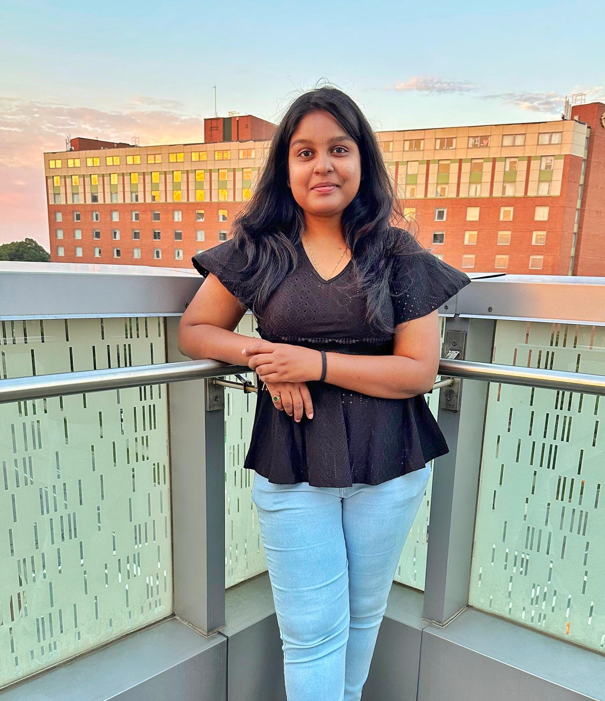

# ETL Project Overview

[Home](index.md) | [BPMN Model](bpmn.md) | [Use Case Model](use_case.md) | [ETL Pipeline](etl_pipeline.md) | [Insights](insights.md) | [Team Contributions](team.md) | [About](about.md)
=======

<html lang="en">
<head>
    <meta charset="UTF-8">
    <meta name="viewport" content="width=device-width, initial-scale=1.0">
    <title>About - ETL Project</title>

    
</head>
<body>

    <h1>Meet Our Team</h1>
   
       
        

        
        <h3>Dr Yashitha Raga</h3>
        
ETL Developer

        

</body>
</html>
