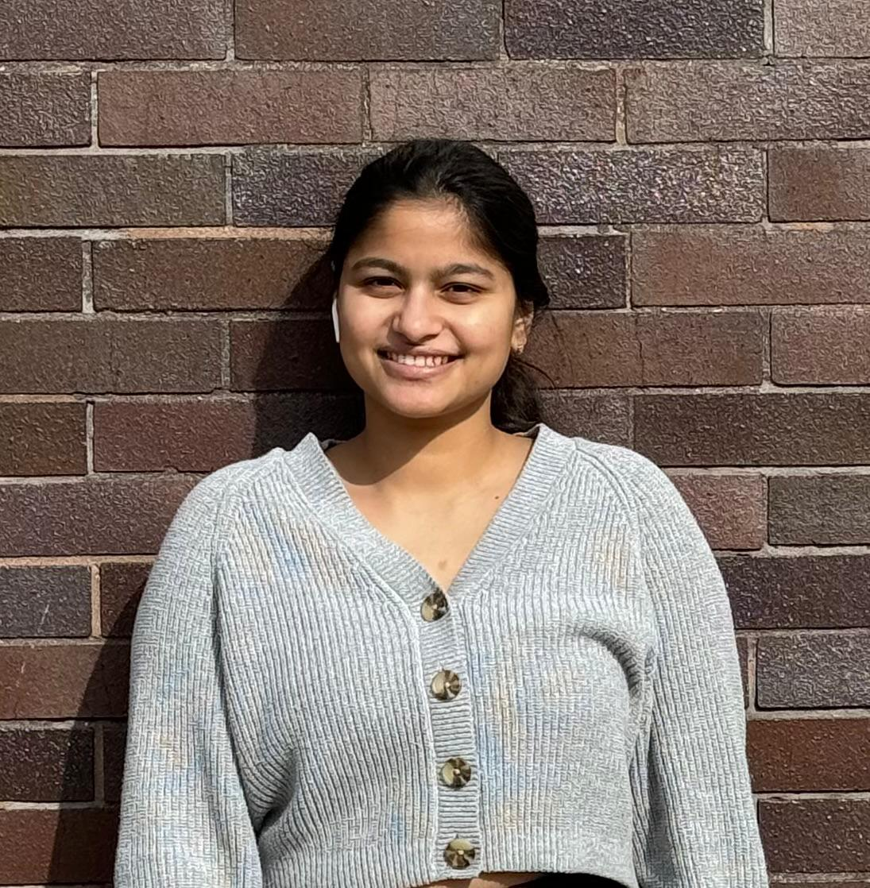

# ETL-Project

[Home](index.md) | [BPMN Model](bpmn.md) | [Use Case Model](use_case.md) | [ETL Pipeline](etl_pipeline.md) | [Insights](insights.md) | [Team Contributions](team.md) | [About](about.md)
=======

<html lang="en">
<head>
    <meta charset="UTF-8">
    <meta name="viewport" content="width=device-width, initial-scale=1.0">
    

    
</head>
<body>

    <h1>Meet Our Team</h1>
    

        

            
            <h3>Dr Yashitha Raga</h3>
            
ETL Developer

        

        

            
            <h3>Dr Aishwarya</h3>
            
ETL Developer

        

        

            
            <h3>Venu Madhav Pentala</h3>
            
ETL Developer

        

        

            
            <h3>Dr Pallavi Vandanapu</h3>
            
ETL Developer

        

        
        

            
            <h3>Haneesha Chowdary Donepudi</h3>
            
ETL Developer

        

    

    <footer>
        
© 2024 ETL Project Team. All Rights Reserved.

        <a href="gift.html" style="color: #FFD700; text-decoration: none;">🎁 Click here!</a>
    </footer>

</body>
</html>

[Back to Home](index.md)

 