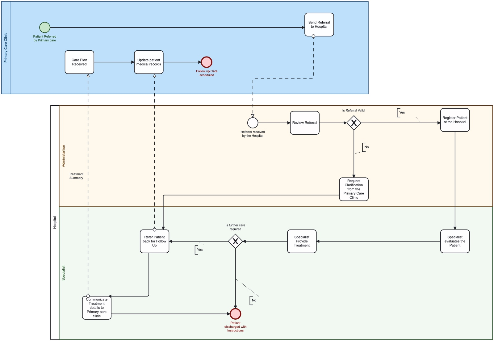

# BPMN Model

## Overview
[This page describes the BPMN model used for the ETL pipeline.](https://modeler.camunda.io/share/cb3c12e0-9a9f-4a13-a489-967c436eec2fg)

The diagram illustrates the ETL process from extraction to loading, with decision points and key tasks highlighted.
[Back to Home](index.md)
