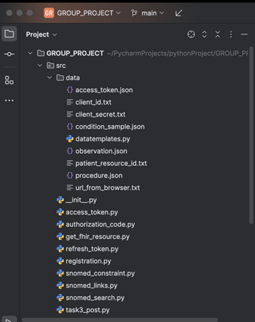
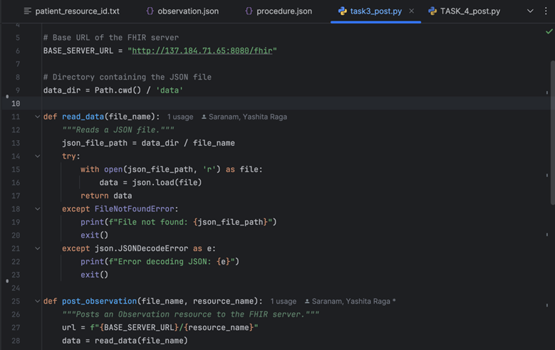
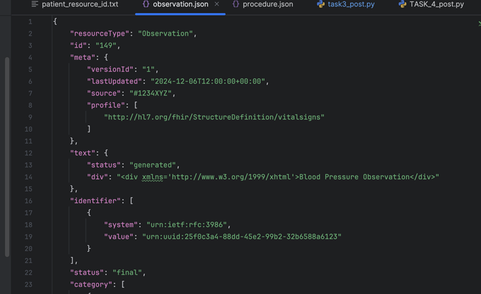
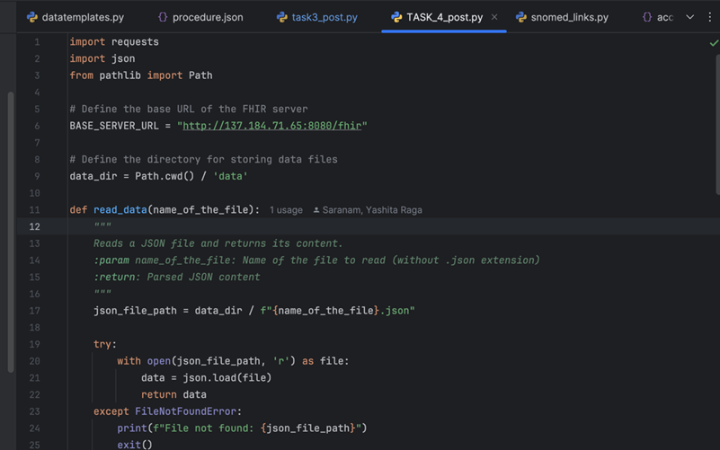
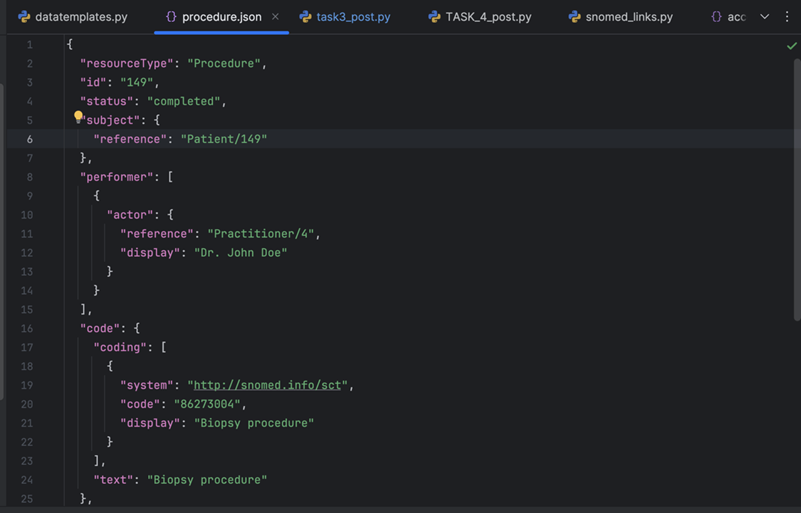
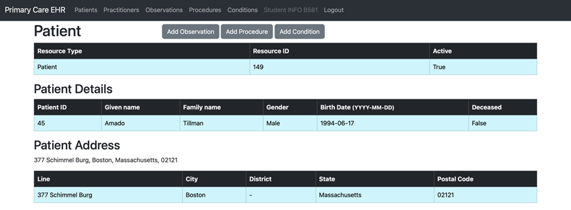
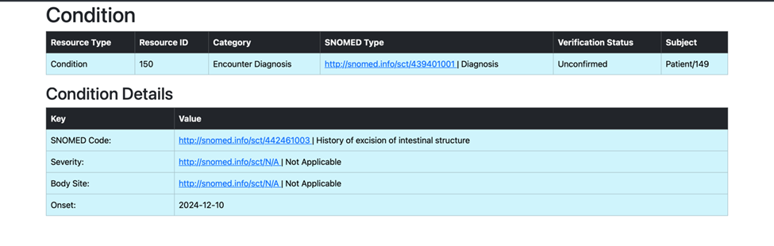
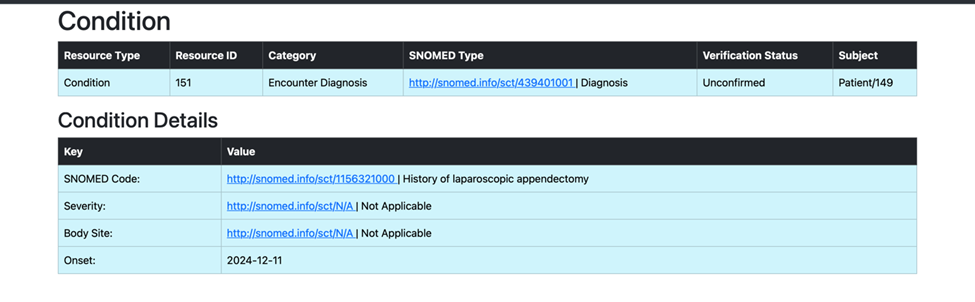
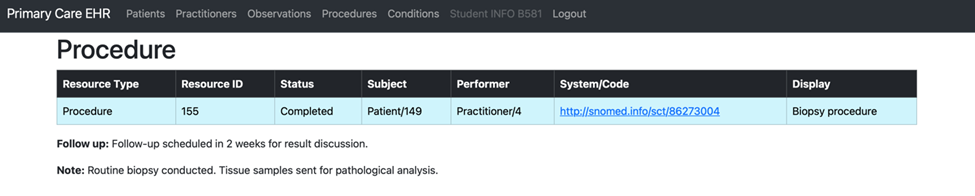
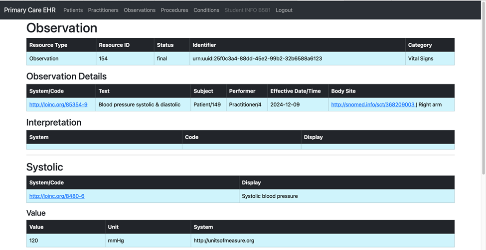

# ETL-Project


[Home](index.md) | [BPMN Model](bpmn.md) | [Use Case Model](use_case.md) | [ETL Pipeline](etl_pipeline.md) | [Insights](insights.md) | [Team Contributions](team.md) | [About](about.md)
=======

# ETL Pipeline Documentation

<div class="etl-card">
    <h2>ETL Pipeline Documentation</h2>
    <h3>1. Overview</h3>
    <p>
        The ETL (Extract, Transform, Load) pipeline is a structured process to automate the movement of healthcare data between systems. It ensures that patient and condition data is retrieved, cleaned, formatted, and loaded into a target system in a consistent and reliable manner. This pipeline focuses on API interactions and adheres to healthcare data standards like HL7 FHIR and SNOMED CT.
    </p>

    <h3>Pipeline Components</h3>
    <ol>
        <li>
            <strong>Extraction:</strong> Retrieving patient and condition data from a source FHIR-compliant API.
        </li>
        <li>
            <strong>Transformation:</strong> Cleaning, structuring, and enriching the extracted data to meet the requirements of the target API.
        </li>
        <li>
            <strong>Loading:</strong> Posting the transformed data into the target API, while ensuring data integrity.
        </li>
    </ol>
</div>

<div class="image-container">
    
</div>


## Extraction
- Uses Python to connect to FHIR APIs.
<div class="etl-card">
    <h2>Extraction Process</h2>
    <p>
        The extraction process involved retrieving data from two main APIs:
    </p>
    <h3>1. FHIR Server for OpenEMR</h3>
    <ul>
        <li><strong>Base URL:</strong> <a href="https://in-info-web20.luddy.indianapolis.iu.edu/apis/default/fhir" target="_blank">https://in-info-web20.luddy.indianapolis.iu.edu/apis/default/fhir</a></li>
        <li><strong>Endpoints:</strong>
            <ul>
                <li><code>/Patient</code>: Retrieve patient details by ID or query parameters.</li>
                <li><code>/Condition</code>: Fetch patient-specific medical conditions.</li>
            </ul>
        </li>
        <li><strong>Authentication:</strong>
            <ul>
                <li>Used OAuth 2.0 for authentication.</li>
                <li>Token management was performed by accessing the endpoint:</li>
                <li><strong>Token URL:</strong> <a href="https://in-info-web20.luddy.indianapolis.iu.edu/oauth2/default/token" target="_blank">https://in-info-web20.luddy.indianapolis.iu.edu/oauth2/default/token</a></li>
                <li>Refresh tokens were stored and updated using utility scripts.</li>
            </ul>
        </li>
    </ul>

    <h3>2. SNOMED CT</h3>
    <ul>
        <li><strong>Base URL:</strong> <a href="http://159.65.173.51:8080/v1/snomed" target="_blank">http://159.65.173.51:8080/v1/snomed</a></li>
        <li><strong>Endpoints:</strong>
            <ul>
                <li><code>/concepts/{concept_id}</code>: Retrieve basic information for a given SNOMED concept.</li>
                <li><code>/concepts/{concept_id}/extended</code>: Retrieves hierarchical parent relationships of the given SNOMED CT concept.</li>
                <li><code>/concepts/{concept_id}/descriptions</code>: Fetches the descriptions or terms associated with a specific SNOMED CT concept.</li>
            </ul>
        </li>
        <li><strong>Authentication:</strong> No authentication was required.</li>
    </ul>
</div>

## Transformation
- Data is cleaned and formatted for the target API.
<div class="etl-card">
    <h2>Transformation Phase</h2>
    <p>
        The transformation phase ensures data is clean, standardized, and formatted to match the target API’s schema. This phase involves:
    </p>
    <ul>
        <li><strong>Validation and Normalization:</strong> Ensuring fields like dates (ISO 8601) and addresses are consistent and error-free.</li>
        <li><strong>Clinical Data Mapping:</strong> Mapping clinical data to SNOMED CT codes using ECL queries for standardization.</li>
        <li><strong>Handling Missing/Invalid Values:</strong> Addressing incomplete or incorrect data to maintain integrity.</li>
    </ul>
    <p>
        The following tools and techniques are integral to the transformation process:
    </p>
    <ul>
        <li><strong>Requests Library:</strong> Used for interacting with APIs, sending data, and retrieving responses.</li>
        <li><strong>Print Function:</strong> Extensively utilized for debugging and verifying data transformations.</li>
        <li><strong>Python Libraries:</strong>
            <ul>
                <li><strong>json:</strong> Streamlines data parsing and formatting.</li>
                <li><strong>datetime:</strong> Facilitates date manipulation and formatting.</li>
            </ul>
        </li>
    </ul>
</div>


## Loading
- Processed data is posted back to the target API.
<div class="etl-card">
    <h2>Loading Phase</h2>
    <p>
        The <strong>src</strong> package in our project serves as a centralized location for core functionality, including data extraction, transformation, and loading (ETL). It ensures modularity, ease of maintenance, and clear organization of project-specific modules and scripts.
    </p>
    <p>
        The following snippet illustrates the arrangement of our project for the Loading phase.
    </p>
</div>


<style>
    /* Card Styling */
    .etl-card {
        background: linear-gradient(135deg, #F0FFF0, #E0FFE0); /* Soft gradient with light greens */
        padding: 30px;
        border-radius: 15px;
        box-shadow: 0 8px 16px rgba(0, 0, 0, 0.2);
        margin: 20px auto;
        max-width: 800px;
        font-family: 'Georgia', serif;
        color: #333;
        transition: transform 0.3s ease, box-shadow 0.3s ease;
    }

    .etl-card h2 {
        color: #006400; /* Dark green for the header */
        text-align: center;
        text-shadow: 2px 2px 5px rgba(0, 0, 0, 0.2);
        margin-bottom: 20px;
        font-size: 2rem;
    }

    .etl-card h3 {
        color: #228B22; /* Forest green for subheaders */
        text-shadow: 1px 1px 3px rgba(0, 0, 0, 0.3);
        margin-bottom: 15px;
        font-size: 1.5rem;
    }

    .etl-card p, .etl-card ol {
        font-size: 1.2rem;
        line-height: 1.8;
        text-align: justify;
    }

    .etl-card ol {
        list-style: decimal inside;
        padding-left: 20px;
    }

    .etl-card ol li {
        margin-bottom: 10px;
    }

    /* Hover Effect */
    .etl-card:hover {
        transform: scale(1.05); /* Slight zoom-in effect */
        box-shadow: 0 12px 20px rgba(0, 0, 0, 0.4); /* Deeper shadow on hover */
        background: linear-gradient(135deg, #E8FFE8, #D0FFD0); /* Brighter gradient transition on hover */
    }

    /* Image Container Styling */
    .image-container {
        text-align: center;
        margin: 30px auto;
    }

    .image-container img {
        max-width: 100%;
        height: auto;
        border-radius: 10px;
        box-shadow: 0 8px 16px rgba(0, 0, 0, 0.3);
    }

    /* Body Styling for Bright Green Background */
    body {
        background-color: #7CFC00; /* Bright green background */
    }
</style>


<div class="image-container">
    
</div>

<div class="etl-card">
    <h2>Code Demonstration: Patient Resource Creation</h2>
    <p>
        The below code demonstrates creating a patient resource in Primary Care EHR by using extracted data from FHIR. It saves the patient resource ID in <strong>patient_resource_id.txt</strong> for further processing and associates a condition with the created patient by transforming the SNOMED concept ID to its parent concept. The code also processes the second condition if available.
    </p>
</div>

```python
# Importing required modules
from data.datatemplates import patient_template_dict, condition_template_dict
from src.registration import data_dir
from src.snomed_links import constraint_parent, expression_constraint

# Base URLs
BASE_URL = "https://in-info-web20.luddy.indianapolis.iu.edu/apis/default/fhir"
BASE_PRIMARY_CARE_URL = "http://137.184.71.65:8080/fhir"
BASE_HERMES_URL = "http://159.65.173.51:8080/v1/snomed"

# Function to get access token from a file
def get_access_token_from_file():
    ...

# Function to get headers
def get_headers():
    ...

# Function to get patient resource ID
def get_patient_resource_id():
    file_path = data_dir / "patient_resource_id.txt"
    try:
        with open(file_path, 'r') as file:
            resource_id = file.read().strip()
            return resource_id
    except FileNotFoundError:
        print(f"Error: {file_path} not found.")
        return None
```
        

<div class="etl-card">
    <h2>Task 1: Patient Template Dictionary</h2>
    <p>
        We created the <code>patient_template_dict</code> in the <strong>data</strong> directory to serve as a predefined structure for patient data. This template is essential for transforming raw data into the required format for submission to the Primary Care EHR, ensuring compliance with the FHIR standard.
    </p>
</div>

```python
def get_fhir_patient(resource_id):
    url = f'{BASE_URL}/Patient/{resource_id}'
    response = requests.get(url=url, headers=get_headers())
    
    if response.status_code != 200:
        print(f"Failed to fetch patient. Status Code: {response.status_code}")
        print(f"Response Text: {response.text}")
        return

    data = response.json()
    print("Response Data:", data)  # Debugging: Inspect the response structure

    # Check if 'name' field exists
    name_list = data.get("name", [])
    if not name_list:
        print("Error: 'name' field is missing or empty in the response.")
        return

    birth_date = data.get('birthDate')
    family_name = data['name'][0]['family']
    given_name = data['name'][0]['given'][0]
    possible_integers = [1, 5, 10, 15, 20, 25, 30, 35, 40, 45, 50]
    address = data.get('address', [{}])[0]
```
```python
    line = address.get('line', [''])[0]
    city = address.get('city', '')
    district = address.get('district', '-')
    state = address.get('state', '')
    postal_code = address.get('postalCode', '')
    text = f"{line}, {city}, {state}, {postal_code}"
    unique_patient_id = random.choice(possible_integers)
    today_date = datetime.today().date().isoformat()
    gender = data.get('gender')

    # Populate the patient template
    patient_template_dict["birthDate"] = birth_date
    patient_template_dict["name"][0]["family"] = family_name
    patient_template_dict["name"][0]["given"][0] = given_name
    patient_template_dict["address"][0]["line"][0] = line
    patient_template_dict["address"][0]["city"] = city
    patient_template_dict["address"][0]["district"] = district
    patient_template_dict["address"][0]["state"] = state
    patient_template_dict["address"][0]["postalCode"] = postal_code
    patient_template_dict["identifier"][0]["period"]["start"] = today_date
    patient_template_dict["identifier"][0]["value"] = unique_patient_id
    patient_template_dict["text"] = text
    patient_template_dict["gender"] = gender
    patient_template_dict["Address"][0]["text"] = text


```

<div class="etl-card">
    <h2>Task 2: Processing and Uploading Second Condition</h2>
    <p>
        With the use of the <code>patient_resource_id.txt</code> file, which stores the generated Patient Resource ID from the first task, we successfully retrieved and processed the second medical condition associated with the patient. Utilizing the SNOMED code from the second condition, we identified and created its corresponding child concept term. This enriched clinical detail was then transformed into a structured format using the predefined template and uploaded to the Primary Care EHR system as a new condition entry, ensuring accurate and comprehensive patient data representation.
    </p>
</div>

```python
def search_condition_second_child(patient_resource_id):
    """
    Retrieve the second condition for a patient and post a new condition with the child concept term
    """
    url = f'{BASE_URL}/Condition?patient={patient_resource_id}'
    response = requests.get(url=url, headers=get_headers())
    if response.status_code == 200:
        data = response.json()
        if 'entry' in data:
            conditions = data['entry']
            # Check if there are at least two conditions
            if len(conditions) > 1:
                second_condition = conditions[1]  # Retrieve the second condition
                snomed_code_from_openemr = second_condition["resource"]["code"]["coding"][0]["code"]
                print(f"Retrieved SNOMED code from the second condition: {snomed_code_from_openemr}")

                child_constraint = constraint_child(concept_id=snomed_code_from_openemr)
                child_concept_id, child_concept_term = expression_constraint(search_string=child_constraint)
                print(f"Identified Child Concept ID: {child_concept_id}")
                print(f"Identified Child Preferred Term: {child_concept_term}")

                condition_template_dict["code"]["text"] = child_concept_term
                condition_template_dict["code"]["coding"][0]["display"] = child_concept_term
```

<div class="etl-card">
    <h2>Task 3: Posting an Observation</h2>
    <p>
        In Task 3, we aimed to post an Observation for the previously created patient directly into the Primary Care EHR. Unlike the earlier tasks, this step did not involve querying the OpenEMR system. Instead, the observation data was manually prepared in a JSON file formatted to comply with FHIR standards. 
    </p>
    <p>
        The Python script utilized a function to read the observation data from the JSON file and another function to post this data to the Primary Care EHR's FHIR endpoint. This approach simplified the process by bypassing external queries and focusing solely on the transformation and loading of pre-formatted observation data, ensuring accuracy and seamless integration into the EHR system.
    </p>
</div>


<div class="image-container">
    
</div>


<div class="image-container">
    
</div>

<div class="etl-card">
    <h2>Task 4: Documenting a Medical Procedure</h2>
    <p>
        In Task 4, a medical procedure was documented for the created patient by crafting a JSON file in the required FHIR format. This file, <strong>procedure.json</strong>, was structured to include all necessary fields, such as the patient reference, practitioner details, and procedure code.
    </p>
    <p>
        Using the <strong>TASK_4_post.py</strong> script, the JSON file was read and posted to the Primary Care EHR system, ensuring seamless integration of procedure details.
    </p>
</div>

<div class="image-container">
    
</div>

<div class="image-container">
    
</div>

<div class="etl-card">
    <h2>Challenges</h2>
    <p>
        Several challenges were encountered during the process of fetching the parent and child terms for conditions, primarily due to incorrect usage of endpoints. These issues were resolved by refining the ECL query and thoroughly testing the endpoints to ensure accuracy.
    </p>
    <p>
        On the other hand, the authentication process and patient retrieval were executed smoothly, largely thanks to the exercises and guidance provided during class sessions. Ultimately, all tasks were successfully completed, and the loaded patient data, along with the associated conditions and procedures, were integrated seamlessly into the Primary Care EHR.
    </p>
</div>

<div class="image-container">
    
</div>

<div class="image-container">
    
</div>

<div class="image-container">
    
</div>

<div class="image-container">
    
</div>

<div class="image-container">
    
</div>

<div class="image-container">
    
</div>


[Back to Home](index.md)


<html lang="en">
<head>
    <meta charset="UTF-8">
    <meta name="viewport" content="width=device-width, initial-scale=1.0">
    <title>ETL Project Overview</title>

<div class="small-container">
    <style>
        /* General Styling */
        body {
            font-family: 'Arial', sans-serif;
            background-color: #CCFFCC;  
            margin: 0;
            padding: 0;
            line-height: 1.6;
        }
        /* Header Styles */
        h1 {
            font-size: 2.8rem;
            color: #4B0082;
            text-align: center;
            margin-bottom: 20px;
            text-shadow: 2px 2px 5px rgba(0, 0, 0, 0.2);
        }
</head>
<body>
