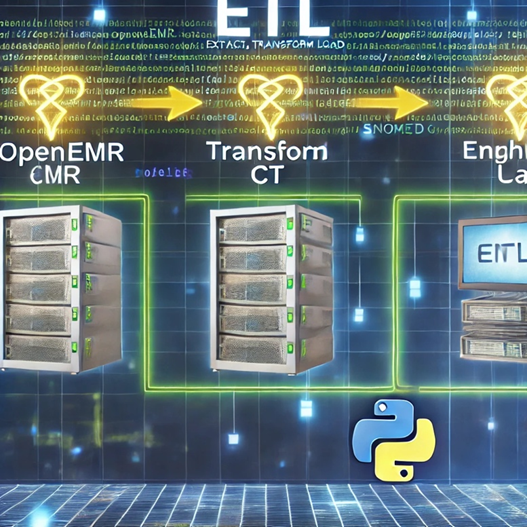

# ETL-Project

[Home](index.md) | [BPMN Model](bpmn.md) | [Use Case Model](use_case.md) | [ETL Pipeline](etl_pipeline.md) | [Insights](insights.md) | [Team Contributions](team.md) | [About](about.md)
=======

# ETL Pipeline Documentation

    <h2>ETL Pipeline Documentation</h2>
    <h3>1. Overview</h3>
    

        The ETL (Extract, Transform, Load) pipeline is a structured process to automate the movement of healthcare data between systems. It ensures that patient and condition data is retrieved, cleaned, formatted, and loaded into a target system in a consistent and reliable manner. This pipeline focuses on API interactions and adheres to healthcare data standards like HL7 FHIR and SNOMED CT.
    

    <h3>Pipeline Components</h3>
    <ol>
        <li>
            <strong>Extraction:</strong> Retrieving patient and condition data from a source FHIR-compliant API.
        </li>
        <li>
            <strong>Transformation:</strong> Cleaning, structuring, and enriching the extracted data to meet the requirements of the target API.
        </li>
        <li>
            <strong>Loading:</strong> Posting the transformed data into the target API, while ensuring data integrity.
        </li>
    </ol>

## Extraction
- Uses Python to connect to FHIR APIs.

## Transformation
- Data is cleaned and formatted for the target API.

## Loading
- Processed data is posted back to the target API.

[Back to Home](index.md)

<!DOCTYPE html>
<html lang="en">
<head>
    <meta charset="UTF-8">
    <meta name="viewport" content="width=device-width, initial-scale=1.0">
    <title>ETL Project Overview</title>

    <style>
        /* General Styling */
        body {
            font-family: 'Arial', sans-serif;
            background-color: #CCFFCC;  
            margin: 0;
            padding: 0;
            line-height: 1.6;
        }
        /* Header Styles */
        h1 {
            font-size: 2.8rem;
            color: #4B0082;
            text-align: center;
            margin-bottom: 20px;
            text-shadow: 2px 2px 5px rgba(0, 0, 0, 0.2);
        }
</head>
<body>
