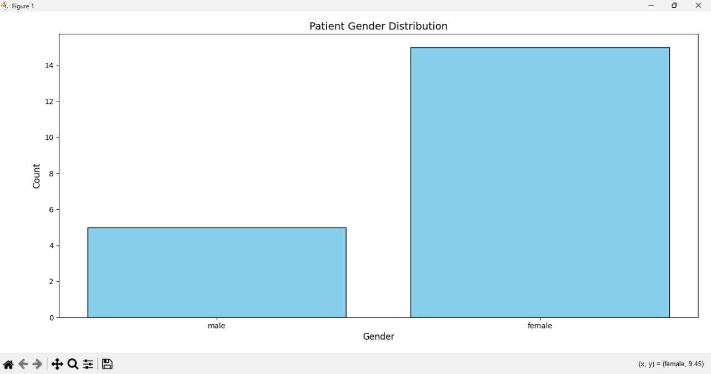

# ETL-Project

[Home](index.md) | [BPMN Model](bpmn.md) | [Use Case Model](use_case.md) | [ETL Pipeline](etl_pipeline.md) | [Insights](insights.md) | [Team Contributions](team.md) | [About](about.md)
=======

<html lang="en">
<head>
    <meta charset="UTF-8">
    <meta name="viewport" content="width=device-width, initial-scale=1.0">
    <title>Project Insights</title>
   
    
</head>
<body>
    <h1>Key Insights Gained from the Project</h1>

    

        <h2>Streamlined Data Interoperability</h2>
        
Implementing the ETL pipeline using FHIR APIs highlighted the potential for seamless data exchange between healthcare systems. For example, integrating patient conditions and observations demonstrated how interoperability can support comprehensive care.

    

    

        <h2>Enhanced Data Quality</h2>
        
The transformation process improved data consistency by handling missing fields and aligning with target system formats, which is critical for reliable analytics and decision-making.

    

    

        <h2>Error Handling Best Practices</h2>
        
Encountering API authentication and retrieval challenges emphasized the importance of robust error-handling mechanisms to ensure system reliability.

    

    <h1>General Reflection on the Project</h1>

    

        <h2>Challenges</h2>
        <ul>
            <li>Handling inconsistent data formats between source and target APIs required additional transformation logic.</li>
            <li>Navigating complex FHIR API documentation and endpoints posed initial hurdles.</li>
            <li>Ensuring secure and seamless API connections involved overcoming authentication barriers.</li>
        </ul>
    

    

        <h2>Lessons Learned</h2>
        <ul>
            <li>Comprehensive planning and understanding of FHIR API structures are essential for efficient ETL pipeline development.</li>
            <li>Modular coding practices enhance reusability and debugging across different ETL tasks.</li>
            <li>Collaboration and clear role definitions among team members significantly improve workflow efficiency.</li>
        </ul>
    

    

        <h2>Potential Improvements</h2>
        <ul>
            <li>Implementing more advanced data transformation techniques.</li>
            <li>Enhancing the visualization of insights with real-time dashboards for stakeholders.</li>
            <li>Automating end-to-end testing of the ETL pipeline to identify and resolve issues early.</li>
        </ul>
    

    <h1>Visualization</h1>

    

        <ul>
            <li>The image shows a bar chart titled "Patient Gender Distribution," representing the gender-based distribution of patient counts retrieved from OpenEMR.</li>
            <li>The x-axis represents the gender categories: "male" and "female."</li>
            <li>The y-axis represents the count of patients.</li>
            <li>The bar for "female" is significantly taller than the bar for "male," indicating a higher count of female patients in the dataset retrieved from OpenEMR.</li>
            <li>The bars are displayed in light blue color for better visibility.</li>
            <li>This chart highlights that the number of female patients is notably higher than that of male patients, according to the OpenEMR data.</li>
        </ul>
    

</body>
</html>

[Back to Home](index.md)

<html lang="en">
<head>
    <meta charset="UTF-8">
    <meta name="viewport" content="width=device-width, initial-scale=1.0">
    <title>ETL Project Overview</title>

    
</head>
<body>

    <footer>
        
&copy; 2024 ETL Project. All Rights Reserved.

    </footer>

</body>
</html>

