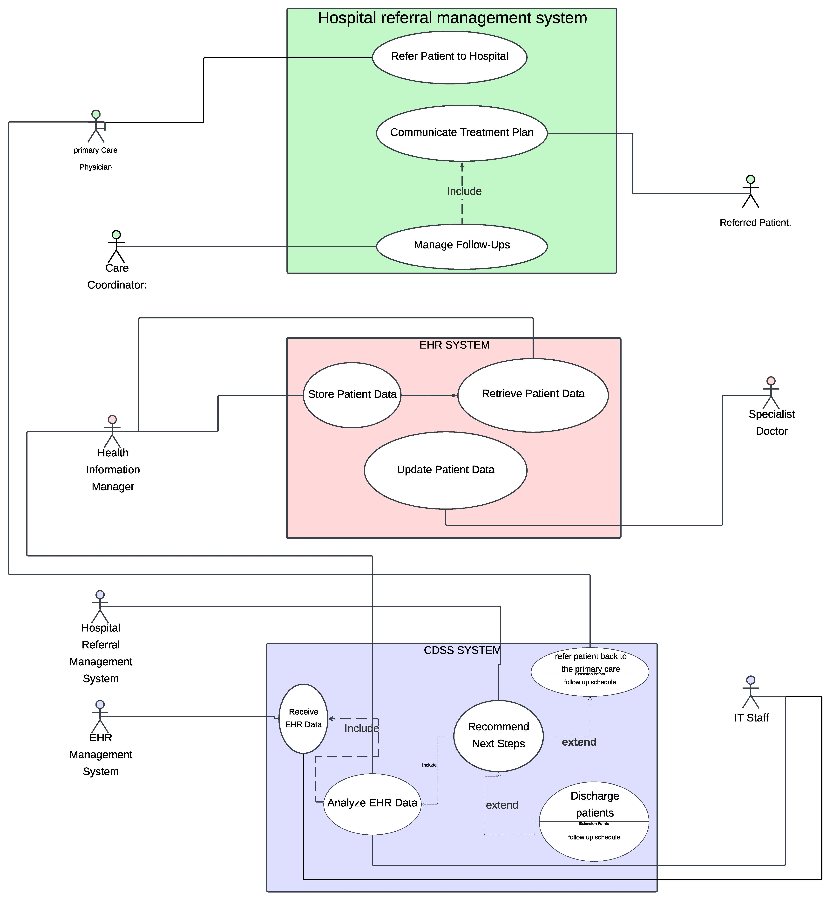

# ETL-Project

[Home](index.md) | [BPMN Model](bpmn.md) | [Use Case Model](use_case.md) | [ETL Pipeline](etl_pipeline.md) | [Insights](insights.md) | [Team Contributions](team.md) | [About](about.md)
=======

# Use Case Diagram

## Overview
The use case diagram outlines the actors and interactions in the ETL pipeline process.

    <!-- Card 1: Use Case Overview -->
    

        <h2>The Use Case Model</h2>
        
The Use Case Model illustrates the integration of the Hospital Referral Management System (HRMS), Electronic Health Record (EHR) System, and Clinical Decision Support System (CDSS) to optimize patient care, referrals, and clinical decision-making.

    

    <!-- Card 2: HRMS -->
    

        <h2>Hospital Referral Management System</h2>
        
The HRMS streamlines the referral process by enabling Primary Care Physicians to refer patients to hospitals and collaborate with Care Coordinators. It facilitates communication of treatment plans and management of follow-ups.

    

    <!-- Card 3: EHR System -->
    

        <h2>Electronic Health Record System</h2>
        
The EHR system serves as a secure central repository for storing, retrieving, and updating patient data. It ensures stakeholders have access to accurate and up-to-date information for informed decision-making.

    

    <!-- Card 4: CDSS -->
    

        <h2>Clinical Decision Support System</h2>
        
The CDSS analyzes data from the EHR system to provide actionable recommendations, such as diagnostic tests, treatment options, or discharge instructions, enhancing clinical workflows and improving patient outcomes.

    

    <!-- Card 5: Integrated Model -->
    

        <h2>Integrated Model</h2>
        
The integrated model emphasizes collaboration and data-driven decision-making. It begins with patient referrals through HRMS, continues with data management in the EHR system, and leverages CDSS insights for treatment plans. Follow-ups are managed efficiently, ensuring continuity of care and improved patient outcomes.

    

[Back to Home](index.md)

<!DOCTYPE html>
<html lang="en">
<head>
    <meta charset="UTF-8">
    <meta name="viewport" content="width=device-width, initial-scale=1.0">
    <title>ETL Project Overview</title>

    <style>
        /* General Styling */
        body {
            font-family: 'Arial', sans-serif;
            background-color: #ADD8E6;  /* Lavender background */
            margin: 0;
            padding: 0;
            line-height: 1.6;
        }
        /* Header Styles */
        h1 {
            font-size: 2.8rem;
            color: #4B0082;
            text-align: center;
            margin-bottom: 20px;
            text-shadow: 2px 2px 5px rgba(0, 0, 0, 0.2);
        }
</head>
<body>
